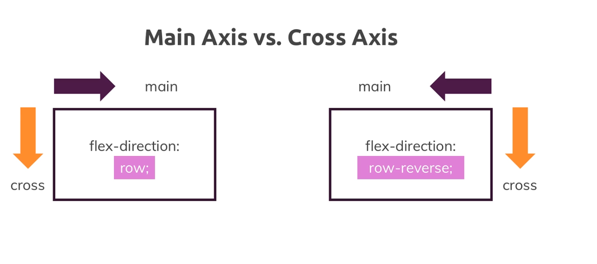

## HTML

1. script tag should placed after body, so that dom is ready

## CSS

### google fonts load issue

use `fonts.loli.net` to replace `fonts.googleapis.com`

```
@import url('https://fonts.googleapis.com/css2?family=Open+Sans:ital,wght@0,300..800;1,300..800&display=swap');
```

````
@import url('https://fonts.loli.net/css2?family=Open+Sans:ital,wght@0,300..800;1,300..800&display=swap');
````


### Set global variables

```
:root {
    --success-color: #2ecc71;
    --error-color: #e74c3c;
}
```


### Flex related 

[Flexbox](https://developer.mozilla.org/en-US/docs/Learn/CSS/CSS_layout/Flexbox)
[CSS flexible box layout](https://developer.mozilla.org/en-US/docs/Web/CSS/CSS_flexible_box_layout)

#### [Concept]  Axis

* main axis ： from 
* cross axis



#### [Properties] align-items

>  it controls the alignment of items on the [cross axis](https://developer.mozilla.org/en-US/docs/Glossary/Cross_Axis). 

* stretch
* start
* end
* center


#### [Properties] justify-content

> defines how the browser distributes space between and around content items along the [main axis](https://developer.mozilla.org/en-US/docs/Glossary/Main_Axis) of a flex container

### [Properties - box]  box-sizing

> The **`box-sizing`** [CSS](https://developer.mozilla.org/en-US/docs/Web/CSS) property sets how the total width and height of an element is calculated.

* content-box

  default CSS box-sizing behavior

* border-box

  tells the browser to account for any border and padding **in** the values you specify for an element's width and height.


EG

```
div {
  width: 160px;
  height: 80px;
  padding: 20px;
  border: 8px solid red;
  background: yellow;
}

.content-box {
  box-sizing: content-box;
  /* Total width: 160px + (2 * 20px) + (2 * 8px) = 216px
     Total height: 80px + (2 * 20px) + (2 * 8px) = 136px
     Content box width: 160px
     Content box height: 80px */
}

.border-box {
  box-sizing: border-box;
  /* Total width: 160px
     Total height: 80px
     Content box width: 160px - (2 * 20px) - (2 * 8px) = 104px
     Content box height: 80px - (2 * 20px) - (2 * 8px) = 24px */
}
```


### [Properties - box] display

> The **`display`** [CSS](https://developer.mozilla.org/en-US/docs/Web/CSS) property sets whether an element is treated as a [block or inline box](https://developer.mozilla.org/en-US/docs/Web/CSS/CSS_flow_layout) and the layout used for its children, such as [flow layout](https://developer.mozilla.org/en-US/docs/Web/CSS/CSS_flow_layout), [grid](https://developer.mozilla.org/en-US/docs/Web/CSS/CSS_grid_layout) or [flex](https://developer.mozilla.org/en-US/docs/Web/CSS/CSS_flexible_box_layout).


TODO

Some values of `display` are fully defined in their own individual specifications; for example **the detail of what happens when `display: flex` is declared is defined in the CSS Flexible Box Model specification.**


# Reference

## CSS flexible box layout

### [Properties](https://developer.mozilla.org/en-US/docs/Web/CSS/CSS_flexible_box_layout#properties)

- [`align-content`](https://developer.mozilla.org/en-US/docs/Web/CSS/align-content)
  This property has no effect on single line flex containers 
- [`align-items`](https://developer.mozilla.org/en-US/docs/Web/CSS/align-items)
- [`align-self`](https://developer.mozilla.org/en-US/docs/Web/CSS/align-self)
- [`flex`](https://developer.mozilla.org/en-US/docs/Web/CSS/flex)
- [`flex-basis`](https://developer.mozilla.org/en-US/docs/Web/CSS/flex-basis)
- [`flex-direction`](https://developer.mozilla.org/en-US/docs/Web/CSS/flex-direction)
- [`flex-flow`](https://developer.mozilla.org/en-US/docs/Web/CSS/flex-flow)
- [`flex-grow`](https://developer.mozilla.org/en-US/docs/Web/CSS/flex-grow)
- [`flex-shrink`](https://developer.mozilla.org/en-US/docs/Web/CSS/flex-shrink)
- [`flex-wrap`](https://developer.mozilla.org/en-US/docs/Web/CSS/flex-wrap)
- [`justify-content`](https://developer.mozilla.org/en-US/docs/Web/CSS/justify-content)


## box model

https://developer.mozilla.org/en-US/docs/Web/CSS/CSS_box_model/Introduction_to_the_CSS_box_model#margin_area


Understand 


## CSS basic

https://developer.mozilla.org/en-US/docs/Learn/Getting_started_with_the_web/CSS_basics


## HTML element types

* block element
  https://developer.mozilla.org/en-US/docs/Glossary/Block
  https://developer.mozilla.org/en-US/docs/Glossary/Block-level_content

* inline element

  https://developer.mozilla.org/en-US/docs/Glossary/Inline-level_content


