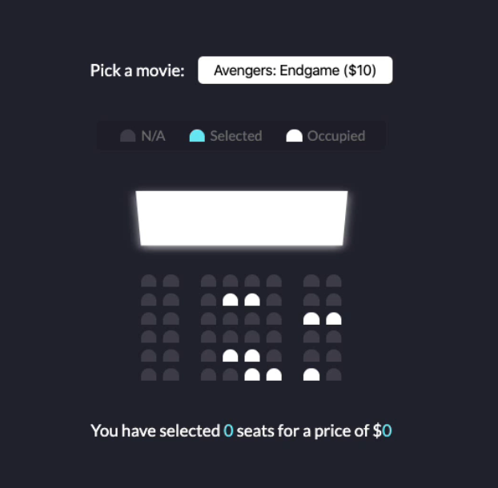

# Project movie_seat_booking

## project intro



##

HTML 103 行
css 124 行
js 58 行

每天平均写 200-300 行代码

## TODO List

### CSS

```
/* TODO vh */
    height: 100vh;
```

```
.movie-container select {

    /* TODO */
    -moz-appearance: none;
    -webkit-appearance: none;
    appearance: none;
}
```

```
.container {
    /* TODO */
    perspective: 1000px;
}
```

```
/* TODO */
.seat:nth-of-type(2) {
    margin-right: 18px;
}
```

Difference b/w

```
.showcase .seat:not(.occupied):hover
```

```
.showcase.seat:not(.occupied):hover
```

```
<ul class="showcase">
            <li>
                <div class="seat"></div>
                <small>N/A</small>
            </li>
            <li>
                <div class="seat selected"></div>
                <small>Selected</small>
            </li>
            <li>
                <div class="seat occupied"></div>
                <small>Occupied</small>
            </li>
        </ul>


.showcase {
    /* TODO remove list style*/
    list-style-type: none;
}
```

```
.screen {
    /* TODO */
    transform: rotateX(-45deg);
    /* TODO */
    box-shadow: 0 3px 10px rgba(255, 255, 255, 0.7);
}
```

### JS

`+` symbol

```
// TODO + symbol
let ticketPrice = +movieSelect.value;
ticketPrice = +e.target.value;
```

localStorage

```
localStorage.setItem('selectedMovieIndex', movieIndex);
localStorage.getItem('selectedMovieIndex');

localStorage.setItem('selectedSeats', JSON.stringify(selectedIndex));

const selectedSeats = JSON.parse(localStorage.getItem('selectedSeats'));
```

innerText

```
count.innerText = selectedSeats.length;
```

classList

```
e.target.classList.contains('seat')
e.target.classList.toggle('selected');
seat.classList.add('selected');
```

### HTML

select option
ur li

inline element

1. lable
2. span

inline element（GPT）

```
<a> - 超链接，用于导航和链接外部资源。
<span> - 通用行内容器，常用于需要添加样式或脚本的文本。
 - 图像，几乎每个网页都有图像展示。
<label> - 表单标签，和输入框配合使用。
<strong> - 强调的粗体文本，用于增强文本的视觉权重。
<em> - 强调文本，通常用于强调或斜体显示。
<input> - 输入控件，表单中必不可少的元素。
<br> - 换行符，常用于手动分隔文本行。
<i> - 斜体文本，常用于强调或表示某些名称、术语等。
<b> - 粗体文本，用于提升可读性或视觉层次。
<small> - 小号文本，常用于版权信息或附加信息。
<sub> - 下标文本，常用于科学公式、脚注等。
<sup> - 上标文本，常用于指数、数学公式等。
<code> - 代码片段，展示代码时常用。
<abbr> - 缩写，表示缩写或缩写解释。
<time> - 日期/时间，表示时间信息。
<q> - 短引用，内嵌短语或引文。
<u> - 下划线文本，尽管不推荐用于装饰，但有时用于表示拼写或特定的含义。
<cite> - 引用，标示来源或作品标题。
<s> - 删除线文本，表示过时信息或修订内容。
<mark> - 标记或高亮显示的文本，强调当前页面上相关内容。
<kbd> - 键盘输入，表示用户输入的文本。
<bdo> - 文本方向覆盖，用于改变文本显示方向。
<data> - 用于将文本与机器可读数据关联，常用于展示数据驱动内容。
<dfn> - 定义术语，表示第一次定义时的术语。
<ruby> - 东亚排版的 ruby 注释，通常用于日语、中文等的发音标注。
<samp> - 样本输出，通常表示计算机输出或示例文本。
<var> - 变量，通常用于展示数学表达式或代码中的变量。
<wbr> - 可选换行符，允许在长字符串或文本块中定义可换行点。
```
